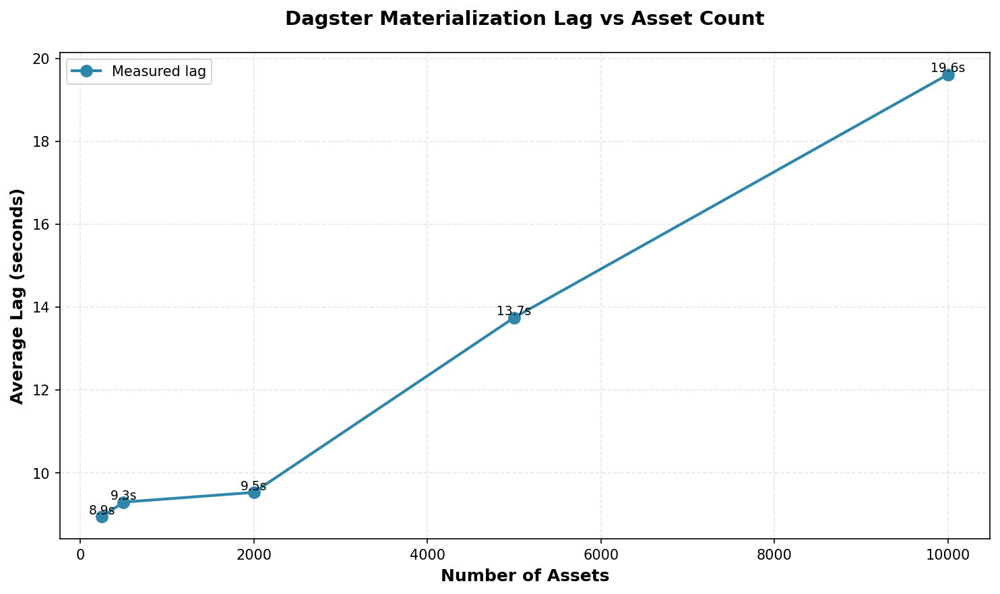
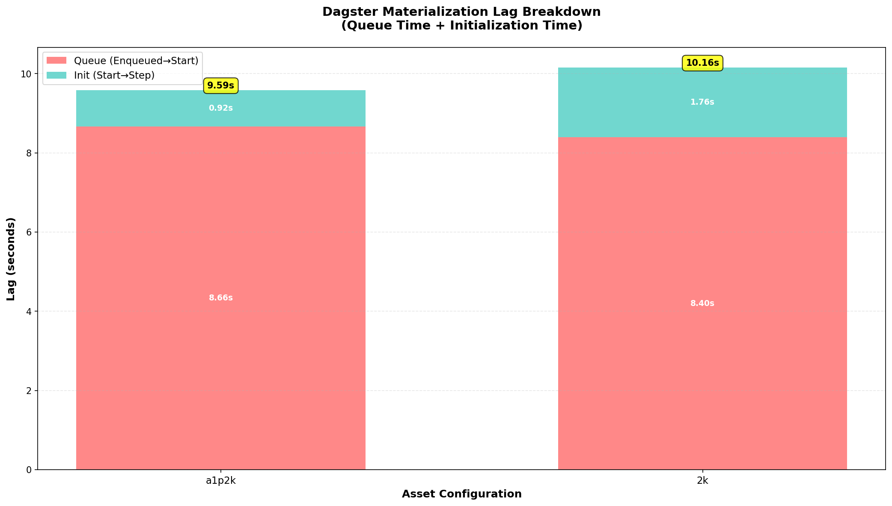
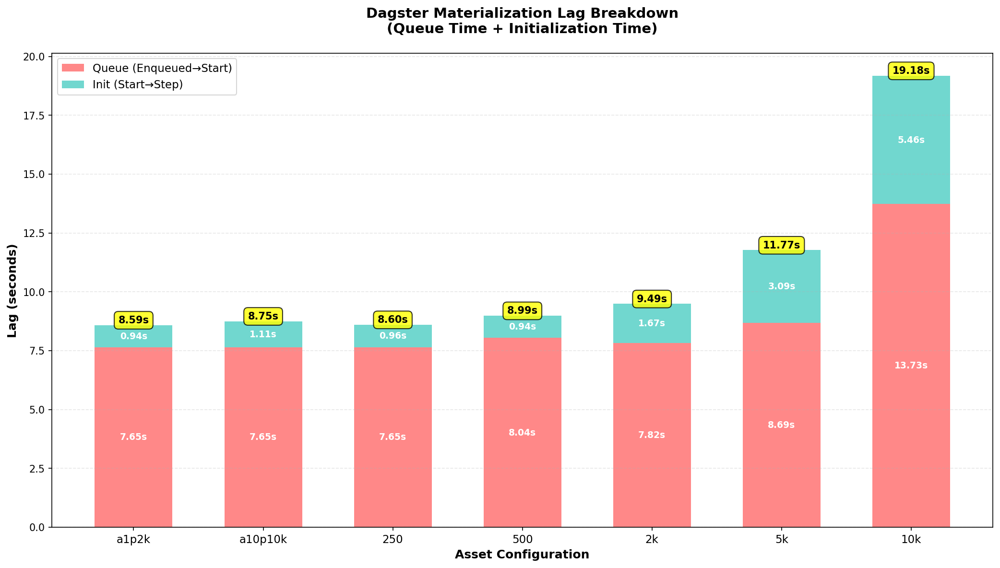

# Analysis of Dagster Performance with respect to assets

## Reproducing the issue

I began by updaing my dagster deployment and trying to reproduce the issue in a configurable manner. The result is a simple code location that can be found under `src/simple_repo`. This allowed me to deploy multiple UDCs(User Defined Code-Location-Server) with the same image having different **Asset/Partition** count. The image is built for two main stream CPU archs and is accessible in my private dockerhub (exact configs can be found in `dagster/values.yaml`), I have deployed 7 different UDCs but one may tweak or add more following the same style. 

The lag submission then began to be evident once I tried to materialize an asset from a UDC with 10k assets.

## The bottle-neck

Here is my understanding of the issue and how the dagster components interact captured in a simple diagram:

The Bottleneck: The Code Location Server

Here is the sequence of events that causes the lag (numbers match the diagram):

1. Request: request for a materialization is made (via UI, API, or schedule).

2. Queuing: The Dagster Daemon picks up the run from the queue.

3. **Definition Loading (The Lag)**: To launch the run, the Daemon (or the Run Launcher it coordinates with) must fetch the job's definition. To do this, it makes a gRPC call to the Code Location Server that holds the Definitions object. The Code Location Server receives the request. It must load the entire Python module and parse the entire Definitions object (with its 1,000s of assets) into memory to find the specific asset/job definition and its dependencies. The Code Location Server finally responds with the job definition with a huge payload.

4. Launch: The Run Launcher now has the definition and can start the job (e.g., spin up a Kubernetes job).

As the Definitions object grows, the time it takes to load and parse it scales near linearly. This process is synchronous and blocks the submission.

## Experiment Design

In order to be able to pragmatically run experiments and assess the effect of asset/partition number on this lag, I developed a simple `bench` cli under `cli/dagster_bench` which has its own docs to help a curious mind how to work with it.

I have broken down the lag into two metrics:
**Two-component lag tracking**:
  - Queue time (RUN_ENQUEUED → RUN_START)
  - Init time (RUN_START → STEP_START)

The first insight that I got was a confirmation of the total **near-linear scale** of the lag with respect to number of assets:

Here we have UDCs with 250, 500, 2k, 5k, and 10k assets.

Next, I tried to check the effect of **number of assets vs number of partitions**:

Here we see that a 2k assets 0 partitions performs noticably worst than 1 asset with 2k partitions (init time is roughly 2 times).

Lastly, I would like to draw your attention to this chart having all my deployments:

The *Queue Time* stays almost consistent up to 2k assets which probably is a good indication for a threshold.

a10p10k holds 100k objects in the definition but it's not at all comparable even to 10k assets with 0 partitinos.

## Possible Solutions

### Solution 1: Split the Definition Object

This is the standard, production-grade solution. Instead of one Definitions object with 9,000 assets, we should have (for example) 3 Definitions objects, each with 3,000 assets, running as 3 separate Code Locations.

Each Code Location runs as its own gRPC server so when we submit a job to materialize an asset, Dagster only queries that specific Code Location.

*Note on Cross-Location Dependencies*

Assets in one code location can depend on assets in another. we define this using SourceAsset. For example, in the intelligence location, we can define an asset that depends on a SourceAsset from the source location.

### Solution 2: Refactor Assets Using @graph_asset
This is a complementary approach we can use within the new, smaller code locations. If we have many small, tightly-coupled assets that are always materialized together, we can combine them into a single @graph_asset.

This reduces the total count of top-level assets in the Definitions object, which further speeds up parsing and simplifies the UI. A graph asset still shows all the individual ops inside it when we click on it, so we don't lose observability.

### Optimizations

- The parsing of Definition object is a CPU-bound process. By observing the cpu usage of code locations, maybe there's cpu throthle happening.
- The top level imports of huge libraries like pytorch could be contributing to the memory usage and speed of the parsing, maybe it would be worth testing inner asset imports.
- A crazy idea :D would be to monkey patch a cache layer close to daemon to hold the definition object and the CI/CD of code location to invalidate that cache along with new definition object. This only would make sense if the core principle of isolation from Dagster is not desired.
- The `bench` cli could be used in the code location CI (to prod) to check if in the staging, the avg submission lag is lower than a threshold (10secs).
